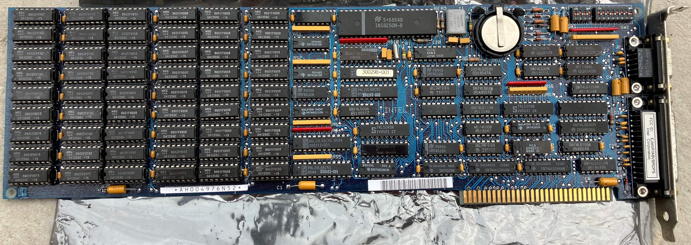
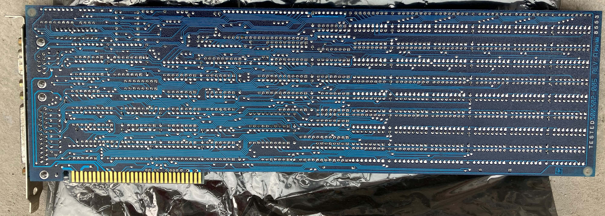
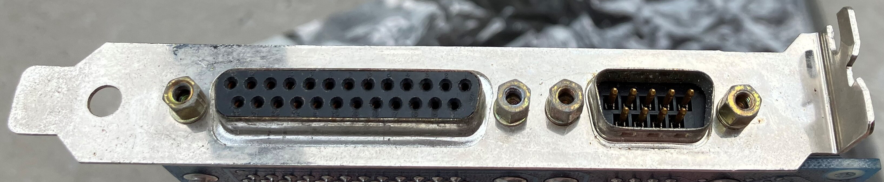

# abovertc - Intel Above Board real-time clock support

I aim to create typical getclock/setclock DOS programs for RTC in Intel Above Board PS/PC card.

Intel Above Board PS/PC is a very cool multi-function ISA card from 1985 for XT class computers.
It has:

- RTC clock;
- serial port, DB-9 connector;
- parallel port, DB-25 connector;
- up to 1.5MB memory if all memory banks are populated with 41256 DRAM chips;
- it can backfill the base memory from 256K or 512K to 640K;
- all memory that wasn't used to backfill base memory can be used as EMS 4.0;
- works reliably at 8MHz with 150ns DRAM chips.

The only problem I had with it is that all the drivers I could find online didn't include support for RTC.
I finally found a driver distribution that did have RTC driver in it.
It was in file intel_above_board_v40a.zip available
[here](https://vetusware.com/download/Intel%20Above%20Board%204/?id=6149).
I shared the good news with fellow enthusiasts
[here](https://forum.vcfed.org/index.php?threads/need-help-with-rtc-on-intel-above-board-ps-pc.77403/).

Intel driver works well, but it takes 1280 bytes of base memory, and on XT that is a lot.

I successfully dissassembled Intel driver. See the source here: [clock.asm](src/clock.asm).
I use DosBox and Microsoft Macro Assembler 5.1 to build it.
Assembled binary matches the original driver exactly.

## Note on licensing

clock.sys driver and derivative works clock.asm and abovertc.asm are copyright (c) 1985 Intel Corporation.
The rest of the code is my and is GPLv3.

## TODO

- optimize inefficiencies to shrink 1280 bytes that Intel driver take in base memory;
- consider converting to NASM/YASM or JWASM, so driver can be built without DosBox;
- develop stand-alone getclock/setclock DOS programs to keep the time accurate without the use of driver.
